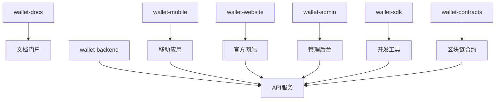

# 仓库说明

本项目采用多仓库架构，按功能和技术栈分离，便于团队协作和独立部署。

## 仓库概览

```
kawaiichainwallet/
├── kawaii-docs          # 📚 项目文档
├── kawaii-mobile        # 📱 移动端应用
├── kawaii-server        # 🚀 后端服务
├── kawaii-website       # 🌐 官方网站
├── kawaii-admin         # 🔧 管理后台
├── kawaii-extension     # 📦 Chrome/Firefox插件
└── kawaii-contracts     # 📜 智能合约
```

## 核心仓库

### 📚 kawaii-docs
**项目文档和说明**

| 属性 | 值 |
|------|---|
| **语言** | Markdown |
| **用途** | 项目文档、API文档、开发指南 |
| **维护者** | 项目团队 |
| **更新频率** | 随项目进展更新 |

**目录结构**
```
kawaii-docs/
├── README.md            # 项目总览
├── FEATURES.md          # 功能特性
├── ARCHITECTURE.md      # 技术架构
├── REPOSITORIES.md      # 仓库说明
├── API.md               # API文档
├── CONTRIBUTING.md      # 贡献指南
├── docs/                # 详细文档
│   ├── user-guide/      # 用户指南
│   ├── developer/       # 开发者文档
│   └── deployment/      # 部署文档
└── assets/              # 图片和资源
```

**重要文件**
- `README.md` - 项目入口介绍
- `API.md` - 完整API接口文档
- `docs/developer/` - 开发者集成指南

---

### 📱 kawaii-mobile
**Flutter 移动端应用**

| 属性 | 值 |
|------|---|
| **技术栈** | Flutter 3.35 + Dart |
| **平台** | iOS / Android |
| **主要功能** | 钱包管理、转账、支付 |
| **部署** | App Store / Google Play |

**目录结构**
```
kawaii-mobile/
├── lib/
│   ├── core/            # 核心功能
│   │   ├── crypto/      # 加密算法
│   │   ├── network/     # 网络请求
│   │   └── storage/     # 本地存储
│   ├── features/        # 功能模块
│   │   ├── auth/        # 用户认证
│   │   ├── wallet/      # 钱包功能
│   │   ├── transaction/ # 交易管理
│   │   └── payment/     # 支付功能
│   ├── shared/          # 共享组件
│   │   ├── widgets/     # UI组件
│   │   ├── utils/       # 工具函数
│   │   └── constants/   # 常量定义
│   └── main.dart        # 应用入口
├── android/             # Android配置
├── ios/                 # iOS配置
├── test/                # 单元测试
└── integration_test/    # 集成测试
```

**核心依赖**
```yaml
dependencies:
  flutter: ^3.35.3
  provider: ^6.0.0       # 状态管理
  dio: ^5.0.0            # 网络请求
  hive: ^2.0.0           # 本地数据库
  crypto: ^3.0.0         # 加密库
  web3dart: ^2.6.0       # 以太坊交互
```

**构建命令**
```bash
# 开发构建
flutter run

# 发布构建
flutter build apk --release     # Android
flutter build ios --release     # iOS
```

---

### 🚀 kawaii-server
**Spring Cloud 微服务后端**

| 属性 | 值 |
|------|---|
| **技术栈** | Java 21 + Spring Cloud |
| **架构** | 微服务架构 |
| **数据库** | PostgreSQL 17 + Redis |
| **部署** | Docker + Kubernetes |

**微服务结构**
```
kawaii-server/
├── kawaii-gateway/      # API网关
├── kawaii-eureka/       # 注册中心
├── kawaii-config/       # 配置中心
├── kawaii-auth/         # 认证服务
├── kawaii-user/         # 用户服务
├── kawaii-core/         # 钱包核心服务
├── kawaii-payment/      # 支付服务
├── kawaii-merchant/     # 商户服务
├── kawaii-notification/ # 通知服务
├── kawaii-common/       # 公共模块
└── docker-compose.yml   # 本地开发环境
```

**服务详情**

#### kawaii-gateway (API网关)
```java
// 端口: 8080
// 职责: 路由转发、负载均衡、限流、认证
// 技术: Spring Cloud Gateway
```

#### kawaii-auth (认证服务)
```java
// 端口: 8081
// 职责: 用户登录、JWT生成、权限验证
// 技术: Spring Security + JWT
```

#### kawaii-user (用户服务)
```java
// 端口: 8082
// 职责: 用户注册、资料管理、KYC验证
// 数据库: user_db
```

#### kawaii-core (钱包核心服务)
```java
// 端口: 8083
// 职责: 钱包创建、私钥管理、地址生成
// 依赖: Web3j, BitcoinJ
```

#### kawaii-payment (支付服务)
```java
// 端口: 8084
// 职责: 转账处理、交易记录、风控检查
// 数据库: transaction_db
```

**部署配置**
```yaml
# docker-compose.yml
version: '3.8'
services:
  mysql:
    image: mysql:8.0
    environment:
      MYSQL_ROOT_PASSWORD: wallet123
      MYSQL_DATABASE: wallet_db
    ports:
      - "3306:3306"
  
  redis:
    image: redis:7.0
    ports:
      - "6379:6379"
  
  wallet-gateway:
    build: ./wallet-gateway
    ports:
      - "8080:8080"
    depends_on:
      - wallet-eureka
```

---

### 🌐 kawaii-website
**Next.js 官方网站**

| 属性 | 值 |
|------|---|
| **技术栈** | Next.js 15 + TypeScript |
| **用途** | 项目介绍、文档展示、下载页面 |
| **部署** | Vercel / Netlify |

**目录结构**
```
kawaii-website/
├── src/
│   ├── app/             # App Router (Next.js 15+)
│   │   ├── layout.tsx   # 根布局
│   │   ├── page.tsx     # 首页
│   │   ├── docs/        # 文档页面
│   │   ├── download/    # 下载页面
│   │   └── about/       # 关于页面
│   ├── components/      # React组件
│   │   ├── Header.tsx   # 页面头部
│   │   ├── Footer.tsx   # 页面底部
│   │   └── ui/          # UI组件库
│   ├── lib/             # 工具函数
│   └── styles/          # 样式文件
├── public/              # 静态资源
├── docs/                # 文档内容
└── next.config.js       # Next.js配置
```

**主要页面**
- `/` - 项目介绍首页
- `/docs` - 开发文档
- `/download` - 应用下载
- `/api-docs` - API文档
- `/blog` - 项目博客

**部署脚本**
```bash
# 构建静态站点
npm run build
npm run export

# 部署到 Vercel
vercel --prod
```

---

### 🔧 kawaii-admin
**Next.js 管理后台**

| 属性 | 值 |
|------|---|
| **技术栈** | Next.js 15+ + TypeScript + Tailwind 4 |
| **用途** | 运营数据、用户管理、系统配置 |
| **权限** | 管理员专用 |

**目录结构**
```
kawaii-admin/
├── src/
│   ├── app/
│   │   ├── dashboard/    # 数据面板
│   │   ├── users/        # 用户管理
│   │   ├── transactions/ # 交易记录
│   │   ├── merchants/    # 商户管理
│   │   ├── settings/     # 系统设置
│   │   └── reports/      # 数据报表
│   ├── components/
│   │   ├── charts/       # 图表组件
│   │   ├── tables/       # 表格组件
│   │   └── forms/        # 表单组件
│   └── hooks/            # 自定义Hooks
├── public/
└── package.json
```

---

### 📜 kawaii-contracts
**智能合约代码**

| 属性 | 值 |
|------|---|
| **语言** | Solidity |
| **网络** | Ethereum, BSC, Polygon |
| **用途** | 多重签名、代币合约 |

**合约结构**
```
kawaii-contracts/
├── contracts/
│   ├── MultiSigWallet.sol    # 多重签名钱包
│   ├── PaymentProcessor.sol  # 支付处理器
│   ├── TokenVault.sol        # 代币金库
│   └── interfaces/           # 合约接口
├── scripts/                  # 部署脚本
├── test/                     # 合约测试
├── migrations/               # 迁移脚本
└── truffle-config.js         # Truffle配置
```

## 仓库关系图



## 开发工作流

### 1. 分支策略
```
main              # 生产环境
├── develop       # 开发环境
├── feature/*     # 功能分支
├── hotfix/*      # 紧急修复
└── release/*     # 发布分支
```

### 2. 提交规范
```bash
# 功能开发
git commit -m "feat: 添加多重签名钱包功能"

# 问题修复
git commit -m "fix: 修复转账金额计算错误"

# 文档更新
git commit -m "docs: 更新API文档"
```

### 3. CI/CD 流程
```yaml
# GitHub Actions 示例
name: Build and Deploy
on:
  push:
    branches: [main]
jobs:
  build:
    runs-on: ubuntu-latest
    steps:
      - uses: actions/checkout@v3
      - name: Build
        run: npm run build
      - name: Deploy
        run: npm run deploy
```

## 环境管理

### 开发环境
- **本地开发**: Docker Compose
- **API地址**: `http://localhost:8080`
- **数据库**: 本地MySQL/Redis

### 测试环境  
- **部署方式**: Kubernetes
- **API地址**: `https://api-test.kawaiichainwallet.com`
- **用途**: 功能测试、集成测试

### 生产环境
- **部署方式**: Kubernetes集群
- **API地址**: `https://api.kawaiichainwallet.com`
- **监控**: Prometheus + Grafana

